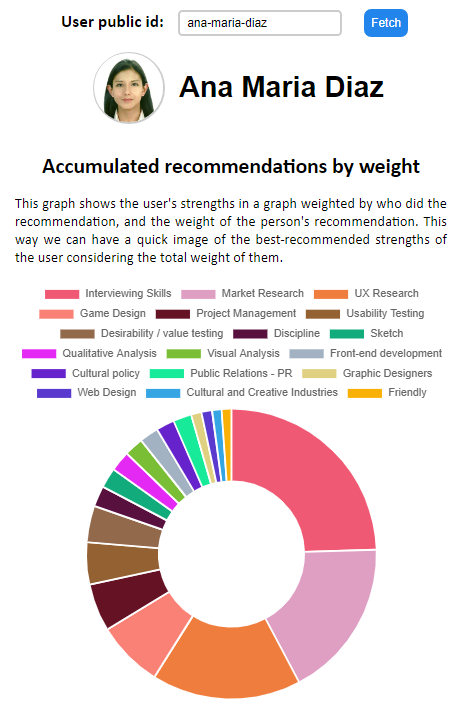

# Torre's Technical Test

## Instructions

Please show us your strengths/skills by building anything you'd like using data from Torre.
The goal is for us to get an idea of your skills/strengths in the areas of web development, software architecture, algorithms, innovation, strategic thinking, autonomy, learning, attention to detail, and communication. If you join our team, you'll be working on the full stack. As such, we'll be evaluating your potential in both front and back end development.

- [ ] You can invest as much time as you'd like.
- [ ] Please log your progress.
- [ ] You have 24 hours to complete it.

Your deliverables are:
- A link for us to test what you built.
- Your progress log.
- A way for us to review your code through a control version system (for example, Github) where we can review your incremental progress.
- Anything else you'd like to share with us.

Please submit your deliverables in this channel.

## Objective

The project objective is to display a graphical representation of the weights of the recommendations for any user.
When you browse a user's recommendations page (like this one for [Ana Maria Diaz](https://bio.torre.co/es/ana-maria-diaz/recs?show=received)) it's kind of difficult to get a clear idea of the user strengths based on recommendations.

Each recommendation has a different weight, depending on who recommends, and above this, you have to visually locate the user's strengths from each recommender and hopefully gather the ones you are interested in your head.

So I thought that it would be a good addition to summarize all those weighted recommendations in one simple graph that will show, based on recommendations, which are the best strengths of the user.

## Deliverables
- [Live site](https://oscarnava.me/torre/) (Alternatively [this link](https://oscarnava.me/torre/?mode=mock) uses mock data; limited to one user: ___ana-maria-diaz___).
- To view progress log, [click here](https://raw.githack.com/oscarnava/torre-technical-test/develop/docs/clockify-2020-04-16.html)

## Points to consider

To fetch the user recommendations I had to reverse engineer that section at ___bio.torre.co___ website. Since I assume this API is not intended for public use, I had to use a proxy to bypass the CORS issue. This, in turn, slows down fetching the data from the server, or at times it won't fetch the data at all.

For this issue, and to reduce requests to the server during development (and speed up things) I created a mock request. To use the mock request, just pass the parameter ___mode=mock___ in the URL.
